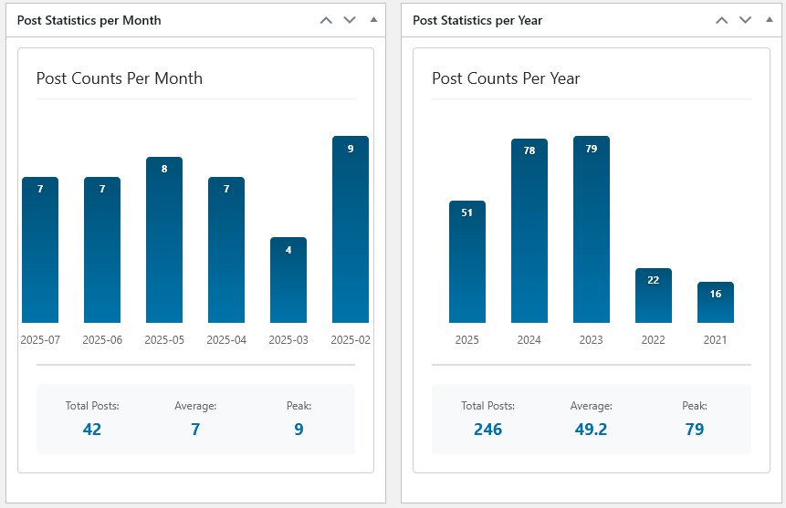
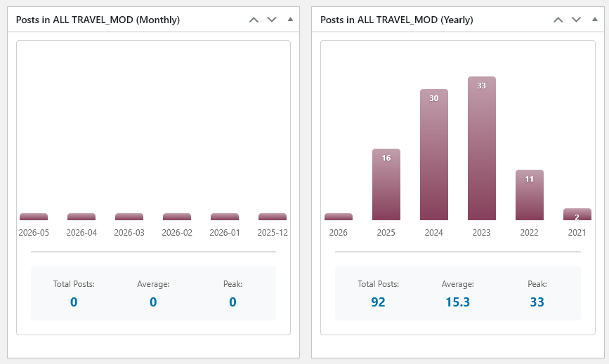
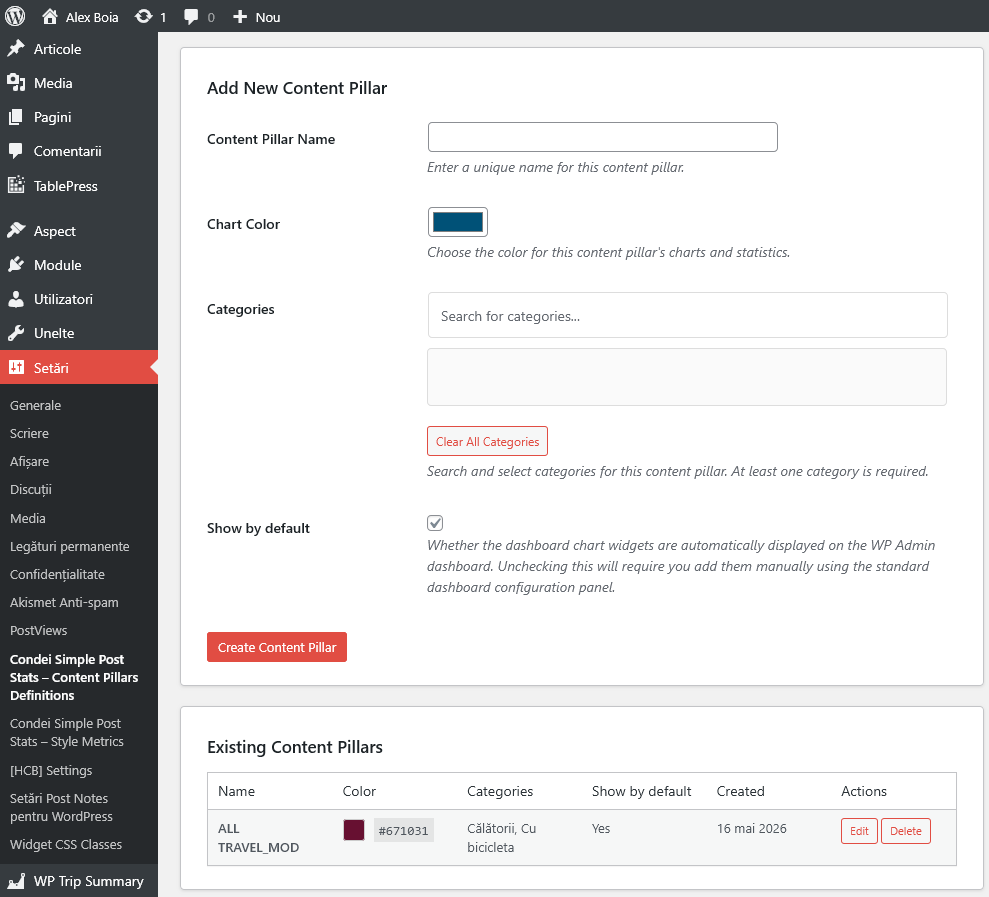
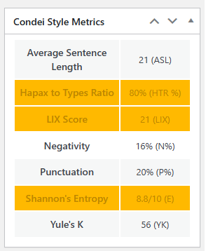
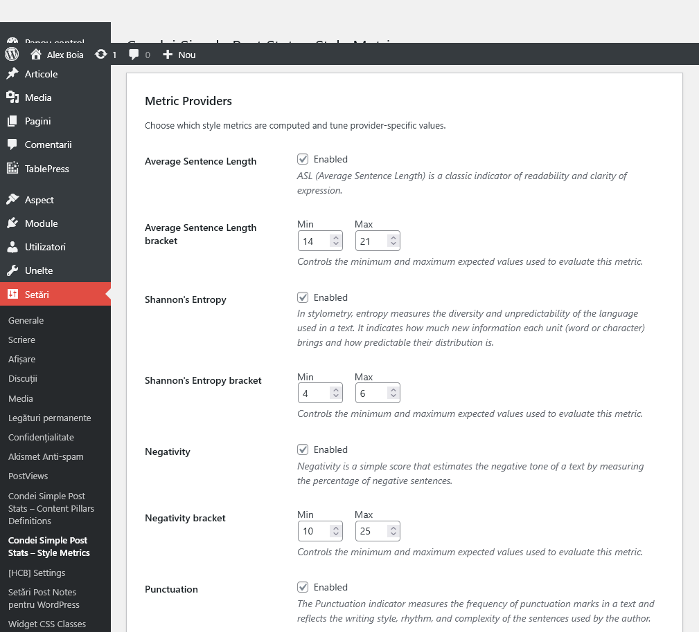

<p align="center">
   
</p>

<h1 align="center">Condei Simple Post Stats for WordPress</h1>

<p align="center">
   A WordPress plugin for displaying simple content creation statistics, while also handling stylometry markers. Initially built for usage on my own website: https://alexboia.net/.
   See features below.
</p>

<p align="center">
   
</p>

## Features

- Track post publishing statistics per month and per year;
- Define content pillars for custom statistics (also per month and per year);
- Advanced stylometry with the following supported metrics: 
   - [Average Sentence Length](https://github.com/alexboia/ABNET-PostStats/blob/main/docs/average-sentence-length.md);
   - [Hapax Legomena - Hapax to Types](https://github.com/alexboia/ABNET-PostStats/blob/main/docs/hapax-to-types.md);
   - [LIX](https://github.com/alexboia/ABNET-PostStats/blob/main/docs/lix.md);
   - [Negativity](https://github.com/alexboia/ABNET-PostStats/blob/main/docs/negativity.md);
   - [Punctuation](https://github.com/alexboia/ABNET-PostStats/blob/main/docs/punctuation.md);
   - [Shannon Entryopy](https://github.com/alexboia/ABNET-PostStats/blob/main/docs/shannon-entropy.md);
   - [Yule's K](https://github.com/alexboia/ABNET-PostStats/blob/main/docs/yuk.md).
- Lightweight and fast performance;
- Clean and intuitive interface;
- Available languages: `English` (default) and `Romanian`.

## Some thoughts

I built this because I wanted a small editorial mirror inside WordPress. Something beyond an optimized vending machine, something simpler and more personal: a way to see my own publishing rhythm.

The first version was plain post statistics: 

   - how many posts I published per month, 
   - how many per year, 
   - the total count, 
   - the average, 
   - and the peak. 
   
Nothing revolutionary. Just enough to see whether the blog is alive, asleep, or pretending to be a quarterly journal by accident.

Then I added content pillars as a sort of "what-if". WordPress categories are useful, but they do not always match the larger editorial directions of a site. A pillar lets me group several categories under one theme and see how much I actually write in that area. For example, a travel pillar can include several travel-related categories without changing the public taxonomy of the site.

The third layer is even more experimental: style metrics. For each post, the plugin can compute indicators as those mentioned above.

These metrics are first and foremost editorial signals: 

   - a high readability score may mean the article is dense; 
   - a high punctuation score may reveal a fragmented or rhetorical rhythm; 
   - a high Yule’s K may suggest too much lexical repetition;
   - a high negativity score may simply mean that the article is doing honest critical work and should be left alone with a cup of coffee and a sharpened axe.

The useful part is less the number itself and more the question it raises: should I split this sentence, vary this vocabulary, reduce this repetition, soften this passage, or deliberately keep the text exactly as it is?

That is why the plugin supports preferred ranges. I do not treat them as universal standards. They are closer to a house style: a personal editorial profile for the kind of writing I want to publish.

Condei Simple Post Stats is free. It may also be the first step in a broader suite of WordPress tools for people who still care about composing text.

The goal is modest: fewer distractions, better editorial awareness, and a writing environment that treats the author as an author, not as a block arrangement technician.

## Credits

For the style metrics part I shameless plugged the idea from Victor's [Paradigma project](https://www.paradigma.ro).

## Screenshots

### Dashboard - default statistics


### Dashboard - custom content pillar statistics


### Dashboard - custom content pillar management


### Dashboard - style metrics on post editor page


### Dashboard - style metric settings


## Requirements

- Requires `WordPress` at least: 6.8;
- Requires `PHP` at least: 7.4;
- Ideally `mbstring` PHP extension should be enabled, but not mandatory.

## Install

Fetch the archive and download it as you would any WordPress plugin. 
Not currently available on WordPress plug-in directory and will not be.

## Building Installation Kit

### Use `build\package-plugin.ps1`

| Parameter | Type | Default | Description |
|-----------|------|---------|-------------|
| `OutputPath` | String | `.\dist` | Directory where the ZIP file will be created |
| `PluginName` | String | `abnet-post-stats` | Name of the plugin (used for folder and file names) |
| `Version` | String | `1.0.0` | Version number to embed in files |
| `IncludeDevFiles` | Switch | `false` | Include development files (examples, tests, etc.) |
| `Verbose` | Switch | `false` | Show detailed logging output |

Call it either from the root plugin directory or from the `build` directory.

### Example

```powershell
.\build\package-plugin.ps1 -Version "1.1.0"
```

Will create an archive in the local `.\dist` folder (within the plugin root).

## Version history

| Version | Changes |
|---------|---------|
| `1.0.0` | Simple per year and per month statistics. |
| `1.1.0` | Introduced per year and per month statistics for custom content pillars; introduced stylometry. |

## Privacy

The plugin does not collect any data. It uses the current WordPress posts table to compute its statistics

##  Hooks

[See here](https://github.com/alexboia/ABNET-PostStats/blob/main/docs/plugin-hooks.md).

## Next?

I don't really intend to update the code unless there's something really wrong with it or if I need anything else on top of what's already here.
Feel free to fork and use as you please.

## Donate

I put some of my free time into developing and maintaining this plugin.
If helped you in your projects and you are happy with it, you can...

[](https://ko-fi.com/Q5Q01KGLM)